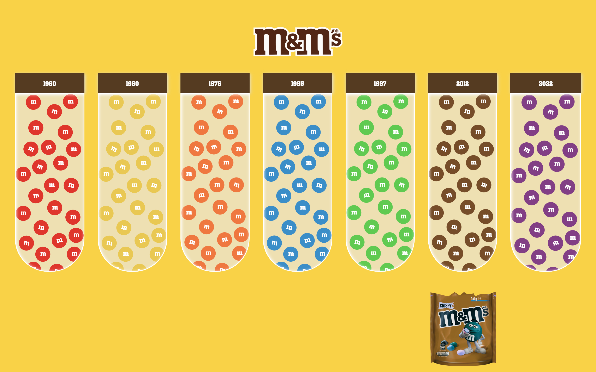
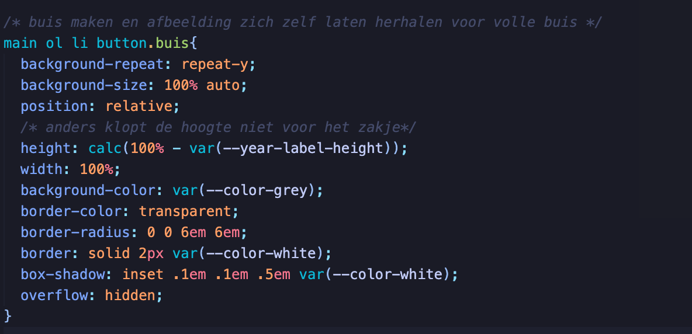

# Procesverslag

## Jij

### Ontwerper:
Yeliz Erbas

#### Je startniveau:
Mijn startniveau is: Blauw

# Je plan

  
De eerste versie/schets van je ontwerp & je persoonlijke uitdaging

  ### De eerste versie/schets:
  

  ### Je ambitie: 
  Aan deze technieken/punten wil ik werken:
 
  - Mijn gebeugen weer opfrissen, want ik ben best veel vergeten
  - Leren animaties en functies samen laten werken met JavaScript en Css
  - Leren om animaties te bedenken die goed passen bij het onderwerp
  - Nieuwe dingen doen die ik nog niet eerder heb gedaan 

## Voortgang/Feedback 1

  
Mijn bevindingen + wijzigingen (minimaal 5)

  Tijdens mijn proces ben ik best wel heel erg vergeten om screenshots te maken omdat ik zo erg bezig was.
  
  ### Bevinding 1:
 Na het maken van mijn ontwerp liep ik gelijk tegen iets aan. Ik kon nergens de juiste afbeelding vinden voor de M&M’s. Er waren alleen maar lelijke afbeeldingen van echte M&M’s. Mijn idee was om een M&M te maken met CSS en die random te laten genereren d.m.v. javascript. Dat scheen erg lastig te zijn.

  #### oplossing:
  Ik heb zelf de M&M’s gemaakt in illustrator en die afbeeldingen gebruikt. Ook heb ik later zelf het zakje gemaakt.
  

  ### Bevinding 2:
  Vervolgens had ik nog een probleem. Ik had mijn plaatje in een img tag gedaan in mijn html. Het plaatje zat in mijn buis. Maar dit zag er heel gek uit. Er zat heel veel wit ruimte tussen.

  #### oplossing:
 Ik heb er een background-img van gemaakt in CSS i.p.v. een gewone img tag in html. Hierdoor zat het plaatje wel in de buizen.
 

### Bevinding 3:
  Door de label met het jaartal klopte de hoogte van de button niet meer. Hierdoor zat het zakje niet goed. 

  #### oplossing:
  De oplossing hiervoor was om de hoogte weer recht te zetten. De hoogte van de label is in een variabele gespot waardoor je ermee kan rekenen. Van hoogte van de buis is dezelfde variabele gebruikt om dit er af te halen waardoor het weer klopte.
  

### Bevinding 4:
  Het zakje onderin vond ik erg leuk. Ik wilde er nog iets mee doen om het leuker te maken, maar ik wist niet echt wat. Je hebt namelijk niet van elke M&M kleur ook een afbeelding van hetzelfde zakje met de juiste kleur. Ik ben ook niet goed in photoshop. Het leek mij ook niet heel belangrijk dus heb ik er geen aandacht aan besteed.

  #### oplossing:
  Sanne heeft mij kennis laten maken met een filter: hiermee kun je de kleuren aanpassen d.m.v. hsl. Dus heb ik dat gedaan en nu is het een stuk leuker! 
  

### Bevinding 5:
  Ik wilde graag een passende hover state toevoegen aan de buizen. Dit wilde ik doen met een linear-gradient. Mijn idee was om een glans effect toe te voegen om duidelijk te maken dat het glazen buizen zijn. Het probleem was dat de glans overvloeide buiten de buizen en er ook een leeg gedeelte zat binnen de buis.

  #### oplossing:
  De oplossing was om gebruik te maken van een conic-gradient. Op die manier had ik geen last van de lelijke overvloeiende lijnen. 
  

## Voortgang/Feedback 2

  
Mijn bevindingen + wijzigingen (minimaal 5)

  
  ### Bevinding 1:
  In mijn ontwerp wilde ik graag M&M’s laten vallen uit de buizen zoals bij een echte M&M’s store. Echter had ik geen idee hoe ik dit zou moeten doen. 

  #### oplossing:
  Ik heb de lieftallige Laurens ingeschakeld en gevraagd hoe ik dit het beste kan doen. Hij gaf als tip om een div te plaatsen die dezelfde kleur heeft als de achtergrond en deze boven de afbeelding te plaatsen van de vallende M&M’s. Dus heb ik zijn advies opgevolgd en gedaan.
  

  ### Bevinding 2:
  Het was tijd om na te denken over de Easter Egg. Ik vond het wek grappig om de cursor zwart en wit te maken voor Sanne, omdat hij graag een zwarte en witte M&M wilde zien. Ook heb ik de achtergrond vol oranje M&M’s gemaakt als je dubbelklikt op het logo. Ik vond het wel grappig, maar wel een beetje saai dus wilde ik het ietsjes leuker maken.

  #### oplossing:
  Ik heb er geluid bij toegevoegd die ik zelf best grappig vind. Het is een geluidje dat vaak wordt gebruikt als er iets ‘doms’ of ‘flauws’ gebeurt. Dus vond ik het bijpassend en het maakt het toch wat leuker.
  

  ### Bevinding 3: 
  Ik vond het wel een goed idee om darkmode toe te voegen aangezien het weinig werk is, en toch veel verschil maakt. Dit was gelukt. Echter werkte mijn zwarte en witte cursor niet. 
  #### oplossing:
  Ik heb hierbij op hulp gevraagd. In plaats van de cursor in de body te zetten heb ik er een variabele van gemaakt. Nu veranderd de cursor wel mee als het van light naar darkmode gaat.
  

  ### Bevinding 4: 
  In mijn ontwerp was het de bedoeling dat het zakje stopt als je een buis aanklikt. Ik ben (onder) gemiddeld in code schrijven, dus heb ik hulp ingeschakeld van de beste programmeur die ik ken, Laurens 😎. Hij heeft mij geholpen met het maken van mijn javascript functie. 
  #### oplossing:
  

   ### Bevinding 5:
  Terwijl ik bezig was met de kleuren merkte ik dat het contrast tussen de gele M&M en de achtergrond erg slecht was. 

  #### oplossing:
  Ik heb de achtergrond kleur aangepast naar een lichter geel. Hierdoor zijn de gele m&ms een stuk beter zichtbaar geworden.
  
  

## Voortgang/Feedback 3

  
Mijn bevindingen + wijzigingen (minimaal 5)

  ### Bevinding 1:
  Bij mijn eerste ontwerp was het idee om bij de pop-ups een M&M te laten zien en een tekstwolkje met een paar zinnen over wat hun karakter anders maakt dan de andere m&ms. Terwijl ik bezig was merkte ik dat ik hiermee niet goed het verschil kan laten zien in de karakteristieken. 

  #### oplossing:
  Ik heb even goed nagedacht wat ik zou kunnen doen om het wel goed in beeld te brengen. En toen bedacht ik mij dat de beste manier is om de reclames te bekijken, daar zijn de immers bekend van en hebben daarin hun karakter ontwikkeld. Dus heb ik veel reclames gekeken en die uitgekozen die naar mijn mening het karakter van elke M&M goed laat zien. 
  

  ### Bevinding 2:
  Ik heb gebruik gemaakt van dialogues om verder informatie te geven over de verschillende M&M’s. Hierbij zat een button om het venster te kunnen sluiten. Die werkte niet helemaal mee qua CSS. Hij pakte namelijk de stijling van de buizen, omdat dat ook buttons zijn. 

  #### oplossing:
  Ik heb van alles geprobeerd, maar het enige dat werkte was een class toevoegen aan de buttons van de buizen. Zelfs nth-of-type(): werkte niet. Zo kon ik de stijling apart houden van elkaar.
  

  ### Bevinding 3:
  Bij mijn ontwerp is het de bedoeling dat er eerst een animatie afspeelt en dan de dialogue opent. 
  #### oplossing:
  Na wat googelen heb ben ik erachter gekomen dat dit kan met een settimeout. 
  

  ### Bevinding 4:
  Ik had wat problemen met de dialogue. Eerst wilde niks behalve de eerste dicht. Toen had ik een functie gemaakt waarbij alles wel dicht ging behalve de eerste. Dus had ik hulp ingeschakeld. 

  #### oplossing:
  Het probleem zat hem in dit: 

  const redCloseButton = document.querySelector("main ol li:nth-of-type(1) dialog > button");
 
  De button zit niet direct in de dialog. Daar zit het form nog tussen. Ook had ik het probleem dat als je de dialogiue afsluit je de video op de achtergrond nog hoorde afspelen. Dus heb ik toegevoegd dat de pagina opnieuw laadt waardoor je de video nier meer kan horen als je de dialogue afsluit.
  
  

  ### Bevinding 5:
  Als laatst hebben wij natuurlijk feedback moeten geven. Dit heb ik gedaan met Annika. Zij gaf aan dat de darkmode niet werkte. Ik was aan het experimenteren met iets maar daardoor was het kapot gegaan en had ik het niet door voor de deadline dus heb ik dat nog kunnen oplossen. Ook gaf zij aan dat zij de achtergrond kleur een beetje oud bollig vindt. Ik heb zitten twijfelen om weer terug te gaan daar de eerste gele kleur die ik had. Dit heb ik uiteindelijk niet gedaan omdat ik het contrast toch ook wel belangrijk vindt. Wel heb ik het iets minder licht geel gemaakt. Het contrast is niet perfect maar zo heb ik een middenweg kunnen vinden tussen de huisstijl en contrast.
  
  
  

## Reflectie

  
Mijn eindresultaat & persoonlijke ontwikkeling

  ### Je uitkomst - karakteristiek screenshot(s):
  

  ### Dit ging goed/Heb ik geleerd: 
  Ik heb best veel nieuwe dingen gedaan en ook dingen opgefrist. Denk aan de conic-gradient en background-image. Dit heb ik ooit eerder gedaan, maar het was wel weer verwaterd. Ook heb ik voor het eerst ::before gebruikt. De ~ . De filter van het zakje heb ik voor het eerst gedaan. Flex-grow en dialogues waren ook helemaal nieuw voor mij. Dus ik ben erg blij dat ik mijn kennis weer heb kunnen verbreden. Nu weet ik als designer beter wat mogelijk is voor de programmeurs en kan ik daar rekening mee houden als ik interfaces ontwerp.

  ### Dit was lastig/Is niet gelukt:
  Het lastigst vond ik natuurlijk javascript. Dat is ook het gene waar in hulp heb ingeschakeld. Dat komt doordat ik er niet heel goed in ben. Ik snap wat er moet gebeuren, maar ik heb de kennis niet om dat dan ook daardwerkelijk te maken.

  

## Bronnenlijst

continu bijhouden terwijl je werkt

1. Laurens <3
2. https://www.youtube.com/watch?v=E6J2fosujWQ
3. https://www.aspsnippets.com/Articles/Open-jQuery-UI-Dialog-Modal-Popup-after-some-delay.aspx
4. https://codepen.io/yelizerbas/pen/OJBpWJq
5. https://css-tricks.com/snippets/css/a-guide-to-flexbox/
6. https://codepen.io/shooft/pen/PoyWMWb
7. https://www.w3schools.com/cssref/pr_background-image.php
8. https://www.northamericansigns.com/pre-attentive-processing-in-sign-design/hsl-color-wheel/

